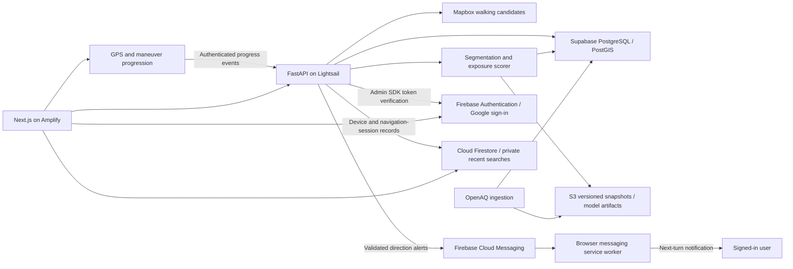

# AeroRoute implementation plan: 8–11 October 2026

**Build window:** Thursday, 8 October through Sunday, 11 October 2026. All times are IST (Asia/Kolkata).

**Source:** [AeroRoute revised proposal](AeroRoute_Revised_Proposal%20%281%29.pdf), pages 1–2.

**Current status — Friday, 9 October:** The local genuine replay flow, validation,
ranking sensitivity, route-quality screening and runtime caching are implemented.
The historical demo area has a reviewed boundary. A separate November period
shows much larger validation errors; the latest audit finds one usable fresh
station, below the three-station requirement. See [DATA_CREDIBILITY.md](DATA_CREDIBILITY.md),
[ROUTE_QUALITY.md](ROUTE_QUALITY.md) and [DATABASE_PERFORMANCE.md](DATABASE_PERFORMANCE.md).
Actual AWS deployment and the final recorded demo remain pending. AWS work is
deferred at the user's request. The original daily checklists below are historical
planning records; their bundled unchecked items can include completed portions.

**Firebase scope added — Saturday, 10 October:** Add Google sign-in, login/logout
and session restoration, private recent route searches in Cloud Firestore, and
opt-in Firebase Cloud Messaging (FCM) direction alerts. The client/Admin SDKs,
private history UI/rules, authenticated navigation endpoints and messaging worker
are implemented. Local rule, Auth/Firestore integration and desktop/mobile browser
checks pass. Google sign-in and owner-only Firestore rules/indexes have been
deployed to `aeroroute-auth-2026`; billing-dependent TTL cleanup is omitted.
The public VAPID key and backend Admin credentials are configured; live Auth,
Firestore read/write/delete and FCM validation checks pass. Actual Google OAuth
and supported-device delivery still need verification. See
[FIREBASE_SETUP.md](FIREBASE_SETUP.md) for activation and test instructions.

## 1. Sunday delivery target

Ship one browser-based flow for a verified Delhi pilot area:

1. Select an origin and destination and enter the maximum extra walking time in minutes.
2. Retrieve available walking-route candidates and display their geometry.
3. Estimate cumulative ambient PM2.5 exposure using segment concentrations and travel times.
4. Compare the fastest evaluated candidate with the lowest estimated exposure candidate within the time budget.
5. Show duration, exposure units, observation timestamps, coverage and uncertainty.
6. Sign in with Google, restore the chosen login session on refresh, and log out with user-specific state cleared.
7. Save signed-in users' recent route searches in Firestore; reopen or delete them from a Recent routes view.
8. During an active journey, show the next maneuver and offer opt-in cloud direction alerts on supported browsers, with foreground guidance available when push is unavailable.
9. Demonstrate the deployed AWS backend and record a three-minute demo, including a case where a longer route has no estimated exposure benefit and a short Firebase user-flow demonstration.

Deliver a working baseline before adding model complexity. Actual exposure reduction and street-level accuracy remain unvalidated; no health guarantee is part of this prototype.

## 2. Scope and responsibilities

The three-person team works concurrently across the responsibilities below; assign tasks within the team as needed. Assume roughly three focused hours tonight, six to eight hours per person on Friday and Saturday, and Sunday reserved for stabilization and recording. Reduce optional work first if availability is lower.

| Role | Primary responsibility | Handoff |
| --- | --- | --- |
| Frontend | Responsive map, Google sign-in/logout, session-aware UI, recent routes and notification permission/receiver | Working interface against the agreed API contract and Firebase user flow |
| Data/model | Monitoring-data audit, interpolation, exposure estimates and validation | Versioned data snapshot, scorer and validation report |
| Backend/AWS + Firebase | FastAPI, routing, Supabase, AWS, Firebase project/Auth setup, Firestore rules and authenticated FCM sender | Comparison API, Firebase access controls, private history and direction-alert delivery |
| All three | End-to-end checks, claims review and demo | Reproducible Sunday demonstration |

| Priority | Work |
| --- | --- |
| Required by Sunday | Walking + PM2.5; one pilot area; origin/destination input; detour control; evaluated-route comparison; interpolation; data quality states; Supabase spatial lookup/cache; Firebase Google sign-in and login/logout/session handling; Firestore recent searches; opt-in FCM direction alerts on supported browsers; Amplify frontend; Lightsail backend; S3 snapshots; CI; validation report; recorded demo |
| Conditional experiment | Gradient-boosted regressor using station-hour labels, road context and weather; only after the required flow works and held-out evaluation is possible |
| After Sunday | CNN; Sentinel-5P regional features; broader geography; field validation; additional travel modes; native background navigation if continuous guidance with the screen locked is required |

Open-Meteo weather and OSM/OSMnx feature extraction belong to the conditional model experiment. They must not block baseline exposure scoring or the demo. Satellite NO2 and aerosol index must not be substituted for measured PM2.5.

## 3. Repository layout

Maintain one frontend, one backend, one workflows directory and one documentation directory. Model/data work lives inside `backend/`.

Original scaffold (the initial setup adds application and configuration files beneath these directories):

```text
AWS-DTU/
├── README.md
├── .gitignore
├── frontend/
│   └── README.md
├── backend/
│   └── README.md
├── .github/
│   └── workflows/
│       └── ci.yml
└── documentations/
    ├── AeroRoute_Revised_Proposal (1).pdf
    └── IMPLEMENTATION_PLAN.md
```

Full build target layout; the setup implements a subset, with deployment and validation work still pending:

```text
frontend/
├── src/app/             # Page and layout
├── src/components/      # Journey form, map, route cards, data-quality notice
├── src/lib/             # API client and map helpers
├── src/types/           # Shared response types
├── tests/               # Critical browser flow
├── package.json
└── .env.example

backend/
├── app/api/             # Health, pilot metadata and comparison endpoints
├── app/core/            # Configuration and database connection
├── app/schemas/         # Request/response models
├── app/services/        # Provider clients, segmentation, scoring and cache
├── app/model/           # Interpolation and conditional regressor
├── migrations/          # PostGIS, stations, observations and cache tables
├── scripts/             # Data audit, ingestion, evaluation and deployment helpers
├── tests/fixtures/      # Small, labelled recorded/synthetic test cases
├── Dockerfile
├── pyproject.toml
└── .env.example

.github/workflows/
├── ci.yml
└── deploy-backend.yml

documentations/
├── API_CONTRACT.md
├── DATA_AUDIT.md
├── VALIDATION_REPORT.md
├── DEPLOYMENT.md
└── DEMO_SCRIPT.md
```

Root `amplify.yml` versions the frontend build spec with app root `frontend`. Configure the corresponding Amplify app/environment using [DEPLOYMENT.md](DEPLOYMENT.md).

Firebase additions to this target layout:

```text
frontend/src/lib/firebase.ts                   # Client-only Firebase initialization
frontend/src/components/auth-provider.tsx      # Auth readiness, user and session lifecycle
frontend/src/components/recent-routes.tsx      # Private saved searches and delete controls
frontend/src/lib/route-history.ts              # UID-scoped Firestore reads/writes
frontend/src/lib/notifications.ts              # Permission and device registration
frontend/public/firebase-messaging-sw.js       # Built/served messaging service worker
backend/app/core/firebase.py                  # Admin SDK and ID-token verification
backend/app/services/notifications.py          # Validated navigation events and FCM sending
firestore.rules                               # User ownership and field validation
firestore.indexes.json                        # Versioned indexes used by history queries
firebase.json / .firebaserc                   # Firebase configuration/project selection
```

Extend the existing `use-journey-navigation.ts` and `navigation.ts` for alert events;
reuse their maneuver/GPS progression. Keep new endpoints under `backend/app/api/`.

## 4. Daily schedule and completion gates

| Day | Focus | Must be working before stopping |
| --- | --- | --- |
| Thursday, 8 Oct | Access checks, pilot decision, contract and app skeletons | Verified provider access or an explicit blocker; agreed contract; local frontend and backend start |
| Friday, 9 Oct | Real routes, data ingestion, baseline scoring and early AWS deployment | One journey returns scored candidates; frontend consumes the API; deployed health endpoint |
| Saturday, 10 Oct | Integration, quality states, validation and full deployment | Required flow works on AWS; edge cases pass; baseline validation recorded; feature freeze at 18:00 |
| Sunday, 11 Oct | Regression checks, documentation and recorded demo | Demo rehearsed and recorded; repository and deployment handoff complete by 18:00 |

### Thursday, 8 October — tonight, approximately 3 focused hours

**First hour: remove access and data uncertainty.**

- [ ] **Backend/AWS:** Verify Mapbox routing access, AWS access in the chosen region, Supabase connectivity and the repository's GitHub Actions settings. Record dependencies and account limits.
- [ ] **Data/model:** Audit Delhi PM2.5 stations, units, provider metadata, recent observation times and historical availability. Save findings in `DATA_AUDIT.md`; do not select the pilot just from the project name or a convenient map location.
- [x] **Frontend:** Implement the initial journey form, optional map selection, comparison placeholders and data-quality notice. Searchable addresses remain optional polish.

**Second hour: agree the contract and initialize applications.**

- [x] **All:** Define the initial coordinate/time-budget contract and explicit pending API states in `API_CONTRACT.md`.
- [ ] **All:** Choose a pilot boundary after the audit and finalize data-quality rules using real monitoring evidence.
- [x] **Backend/AWS:** Initialize FastAPI, configuration, `/health`, request validation and local CORS. Add the backend environment template and container skeleton.
- [x] **Frontend:** Initialize Next.js, TypeScript and Tailwind inside `frontend/`; add the page shell, map component and form with clearly pending results.

**Final hour: prepare Friday's real data path.**

- [ ] **Data/model:** Save a small genuine monitoring snapshot with observation and fetch times; specify the interpolation interface and draft freshness/coverage parameters.
- [ ] **Backend/AWS:** Run one walking-directions request for a pilot journey; inspect candidate count, geometry and step timings. Prepare database migrations and CI commands once the dependency manifests exist.
- [ ] **All:** Check that both apps start locally, choose demo journey candidates and assign Friday's remaining blockers.

**Gate:** Access and pilot evidence are recorded; applications start; the contract is fixed. If fresh Delhi data is unavailable, explicitly plan a recorded-data replay with original timestamps and a visible limited-data live state. The live-data target remains unmet until access/coverage is resolved.

### Friday, 9 October — routing, baseline and deployment skeleton

**09:30–12:30: implement independently against the contract.**

- [x] **Backend/AWS:** Implement the walking-route provider client, normalize route IDs/geometry/durations, validate inputs and handle provider errors/timeouts. Enable PostGIS and apply stations/observations/cache migrations.
- [x] **Data/model:** Implement ingestion with deduplication, unit checks, timestamps and provisional distance-weighted station interpolation.
- [x] **Data/model:** Fetch historical station-hour labels for validation; review actual coverage before accepting the prototype radius/window policy. Downloaded 462 derived labels from ten locations; radius/window review is documented, and policy remains provisional pending route/validation checks.
- [x] **Frontend:** Implement coordinate/map selection, detour slider, map overlays, route cards and loading/error/single-route states. Scored-state browser/mobile verification remains below.

**13:30–16:30: make one real comparison work.**

- [x] **Backend/AWS + Data/model:** Segment routes, preserve travel time, compute cumulative exposure, enforce the exact detour limit and implement comparison responses with snapshot/data/model versions.
- [x] **Backend/AWS:** Implement runtime comparison caching with versioning, expiry and freshness checks. Fixture-tested; actual database hit/miss verification remains part of genuine integration.
- [x] **Frontend:** Consume the comparison API; show units, source timestamps in IST, explicit live/replay mode and time-weighted support limitations.
- [x] **Frontend:** Verify scored and limited-data states in the browser on desktop and mobile. Ten Playwright tests pass with explicitly synthetic responses; genuine map/API verification remains below.
- [ ] **Backend/AWS:** Configure Amplify for the frontend subdirectory and deploy the minimal FastAPI container to Lightsail. Build spec, infrastructure template and manual deployment workflow are ready; AWS access/targets and actual public health verification are missing.

**16:30–18:30: integration checkpoint.**

- [x] **Backend/AWS:** Add CI for frontend checks/build, backend lint/tests and container build.
- [ ] **Backend/AWS:** Configure S3 timestamped snapshots and document the basic deployment procedure. Bucket template, immutable publisher, manifest dry run and instructions are complete; actual upload awaits AWS access/bucket.
- [ ] **All:** Run one pilot journey end to end locally, adjust its detour allowance and verify any selected alternative stays within the limit. Code/browser fixtures and repeatable checker are ready; Mapbox/database access and pilot evidence remain missing.
- [x] **Data/model:** Record synthetic baseline arithmetic, timing, support and ranking checks in [EXPOSURE_BASELINE.md](EXPOSURE_BASELINE.md).
- [x] **Data/model:** Confirm sufficient independent stations/time periods for Saturday's validation and optional model experiment. Ten geographically separate locations/public metadata and two time blocks were reviewed; 364 labels have valid held-out donors. Capacity supports a limited retrospective baseline evaluation; optional ML is deferred. Actual error/sensitivity evaluation remains Saturday's work.

**Gate:** Real route geometry and a real-data baseline score reach the browser; the AWS backend health check works. If this gate slips, cancel optional model/weather/road-feature work and finish the core flow first.

### Saturday, 10 October — reliability, validation and full AWS flow

**09:30–12:30: finish required behavior.**

- [ ] **Backend/AWS + Data/model:** Add missing/stale/limited-coverage behavior, uncertain-ranking behavior, exact-budget boundaries and safe handling when the fastest route is also the lowest-exposure candidate.
- [ ] **Frontend:** Finish all data-quality states and mobile layout; keep replay labels and observation times visible. Prevent an older API response from replacing a newer journey/detour request.
- [ ] **Backend/AWS:** Complete the full Amplify-to-Lightsail flow, production CORS, Supabase queries/cache and S3 snapshot loading; verify the deployed container reports its app/data/model versions.

**13:30–16:30: validate and make the model decision.**

- [ ] **Data/model:** Evaluate interpolation with held-out stations and later time periods; record MAE/RMSE, sample counts, split rules, missingness and spatial limitations in `VALIDATION_REPORT.md`.
- [ ] **Data/model, only if the required flow already passes:** Assemble road, weather and time features and evaluate one gradient-boosted regressor with the same leakage-safe splits. Adopt it only if a documented improvement and acceptable serving cost are demonstrated; otherwise keep interpolation and record the outcome.
- [ ] **Backend/AWS + Frontend:** Run the acceptance matrix below against the integrated app and measure response latency with cache hits and misses separated.
- [ ] **All:** Select a reproducible case where a longer route fails to lower estimated cumulative exposure. Use genuine observations when possible; label any recorded replay or synthetic illustration explicitly.

**16:30–18:00: freeze the build.**

- [ ] **Backend/AWS:** Redeploy the validated build, finish the backend deployment workflow and smoke-check the public URLs.
- [ ] **All:** Close material integration failures, record known limitations and freeze new features at **18:00**. Begin the demo script and deployment handoff.

**Gate:** The required AWS flow and edge states pass. Validation is reported honestly; unavailable validation is marked unavailable with its cause, never replaced by invented error figures.

### Sunday, 11 October — stabilization and demonstration

- [ ] **09:30–11:00, all:** Recheck the deployment, provider access, current data age, detour enforcement, narrow/mobile layout and the core regression cases. Fix demo-blocking failures only.
- [ ] **11:00–13:00, Backend/AWS:** Finish setup/run instructions, environment-variable inventory, public endpoints, deployed versions and rollback instructions in `DEPLOYMENT.md` and the README.
- [ ] **11:00–13:00, Data/model:** Finalize data sources, pilot rationale, evaluation results and model limitations. Store the demonstration snapshot in S3 with a manifest identifying its sources and original observation times.
- [ ] **11:00–13:00, Frontend:** Finalize the three-minute script, screenshot/recording layout and readable freshness/uncertainty copy.
- [ ] **14:00–16:00, all:** Rehearse twice and record the full demonstration. Clearly identify whether each case uses live observations, recorded observations or synthetic test data.
- [ ] **16:00–18:00, all:** Verify the recording plays, links work, CI passes and handoff documentation matches the shipped behavior. Record deferred work and mark completed tasks.

**Gate:** Demo video, running URLs, reproducible setup and validation/limitations documentation are ready by **18:00 IST**. This is an internal target; no external submission deadline was provided.

### Firebase implementation sequence — added 10 October

The existing frontend and backend owners share this additional required scope.
Complete these steps in dependency order alongside the
remaining baseline work. The original feature-freeze checklist predates this
addition; record any unfinished Firebase gate explicitly in the Sunday handoff.

- [x] **Backend/AWS + Firebase:** Verify project access, enable Google sign-in, authorize localhost/127.0.0.1 and deploy owner-only Firestore rules/indexes. Gate passes: rules tests reject anonymous and cross-user access. Hosted domains must be added when AWS deployment resumes.
- [x] **Backend/AWS + Firebase:** Configure backend Admin credentials and the public VAPID key; verify live Auth lookup, Firestore read/write/delete and FCM validation without sending messages. TTL cleanup is omitted on the billing-disabled project; runtime session expiry is enforced.
- [ ] **Backend/AWS + Firebase:** Verify actual Google OAuth and supported-device next-turn delivery through the app.
- [x] **Frontend + Backend/AWS:** Add Firebase client/Admin SDKs, Google login/logout, persistence selection, auth readiness and protected API verification. Local gates pass: emulator login, refresh, persistence/logout and revoked-token rejection, with UID isolation. Real OAuth remains a deployment gate.
- [x] **Frontend:** Persist completed user-initiated searches, list recent routes, reopen with a fresh comparison and implement delete/clear controls. Gate passes locally: history survives logout/login and is isolated between two emulator accounts.
- [ ] **Frontend + Backend/AWS:** Register consenting devices, connect navigation progress to the authenticated FCM sender, add foreground/background receivers and stop/logout cleanup. Gate: a real supported device receives a valid next-turn alert; stale/duplicate alerts are suppressed and denied permission preserves in-app guidance.
- [ ] **All:** Run the Firebase acceptance cases below, record browser/device support, update environment/setup/API documentation and include the user flow in the demo. Emulator tests alone do not prove Google OAuth or actual push delivery.

## 5. Architecture and API handoff



| Endpoint to implement | Contract |
| --- | --- |
| `GET /health` | Process health and application version; keep provider availability separately observable |
| `GET /api/pilot` | Pilot boundary, supported mode, data mode, observation-time range and coverage notice |
| `POST /api/routes/compare` | Origin/destination as `{lat, lng}`, `max_detour_minutes >= 0`, walking mode; returns evaluated candidates and comparison metadata |

The comparison response must include route IDs, GeoJSON geometry, distance in metres, duration in seconds, exposure in `µg·min/m³` or `null`, within-budget flags, fastest ID, lowest-exposure eligible ID or `null`, recommendation status, warnings and model-estimated reduction or `null`. Include source/provider IDs, observation-time range, fetch time, coverage, live/replay mode and data/model version. Keep timestamps in UTC internally and display them clearly in the interface.

Suggested result states: `comparison_available`, `uncertain_difference`, `no_lower_exposure_candidate`, `single_candidate`, `limited_data` and `no_route`. A provider failure must not silently become a successful fixture response. Recorded replay is a visible, explicit mode.

Database minimum: stations with spatial coordinates; observations with sensor/time/unit/value metadata; snapshot manifests; and route comparison cache entries with expiry and data/model version. Include origin, destination, travel mode, time bucket, data/model version and detour allowance in the comparison cache key. A cached response must be reassessed for freshness when served.

### 5.1 Firebase service responsibilities

| Service | AeroRoute responsibility |
| --- | --- |
| Firebase Authentication | Google identity, login/logout, persisted browser authentication and SDK-managed token refresh |
| Cloud Firestore | Per-user profile, recent route searches, device registrations and short-lived navigation-session metadata |
| Firebase Cloud Messaging | Deliver validated, opt-in direction alerts to the device running the journey |
| FastAPI with Firebase Admin SDK | Verify Firebase ID tokens, enforce ownership for server operations and send FCM messages |
| Supabase PostgreSQL/PostGIS | Spatial monitoring data, observations, exposure lookup and shared comparison cache |
| AWS Amplify, Lightsail and S3 | Frontend hosting, backend execution and versioned data/model artifacts |

### 5.2 Google sign-in and login/logout sessions

1. Enable the Google provider and use the Firebase web SDK's Google sign-in flow. Handle cancelled/blocked popups and account errors visibly. If using redirect on mobile, configure and test the redirect flow for the Amplify/custom domain. [Google sign-in](https://firebase.google.com/docs/auth/web/google-signin), [redirect deployment guidance](https://firebase.google.com/docs/auth/web/redirect-best-practices).
2. Put auth state in a client-side provider with explicit loading, signed-out and signed-in states. Wait for the initial auth observer before reading private history. Use session persistence by default; offer **Remember me** for local persistence across browser restarts. Let Firebase manage refresh tokens; never copy credentials into Firestore. [Authentication persistence](https://firebase.google.com/docs/auth/web/auth-state-persistence).
3. For protected FastAPI requests, send the Firebase ID token as `Authorization: Bearer <token>`. Verify it with the Admin SDK, including revocation checks, and derive the UID from the verified token. Reject invalid/expired/revoked tokens with `401`; attempt one SDK refresh before asking the user to sign in again. [ID-token verification](https://firebase.google.com/docs/auth/admin/verify-id-tokens), [session revocation](https://firebase.google.com/docs/auth/admin/manage-sessions).
4. On logout, stop the journey, deactivate its server session/device association while authentication is available, unregister this browser's messaging subscription, and call Firebase `signOut`. Always clear local history/profile state, Firestore listeners and pending user-specific requests, even if remote cleanup fails. Clear the service worker's active-journey state and displayed notifications; server expiry handles abandoned sessions. Account switches run the same cleanup before loading the next UID.
5. Keep guest route comparison available; request login when the user wants synchronized history or cloud alerts. Auth sessions are managed by Firebase Auth. Firestore navigation-session records below describe a journey and do not grant login access. Ordinary logout ends this browser session; global token revocation is a separate administrative operation.

### 5.3 Firestore recent routes and user data

The implementation uses these document paths, with timestamps in UTC:

| Path | Minimum fields and access |
| --- | --- |
| `users/{uid}` | `displayName`, `avatar`, `updatedAt`; owner-only access with an explicit allowed-field list |
| `users/{uid}/recentSearches/{searchId}` | Origin/destination coordinates and labels, travel mode, detour minutes, `searchedAt`, comparison status, optional selected route ID, data mode and data/model versions; owner can read/write/delete |
| `users/{uid}/devices/{deviceId}` | FCM recipient registration for the pinned SDK, permission/enabled state, `updatedAt`; managed through authenticated backend endpoints, no direct client writes |
| `users/{uid}/navigationSessions/{journeyId}` | Device ID, provider `routeJson`, route ID/version, projected progress, last alert key/sequence, active state, `lastSeenAt`, `expiresAt`; backend-managed, owner-readable |
| `users/{uid}/alertLimits/current`, `pushBindings/{recipientHash}` | Backend-only registration throttling and unique recipient ownership; direct client access denied |

- Save once when a signed-in user's explicit search returns a valid comparison response, including limited-data/no-route outcomes. Use a stable search request ID for idempotent retries; do not add entries for every GPS update or automatic reroute. A Firestore failure shows **Route not saved** with retry while preserving the comparison result.
- Load the latest 20 searches ordered by `searchedAt` descending and paginate older entries. Reopening fills the form and requests a fresh comparison; saved route IDs and estimates are historical context, not a current routing result. Support deleting an entry and clearing all history, including entries outside the first page.
- Keep history across logout/login and across devices for the same UID. Use memory-only Firestore caching initially; cancel listeners and discard responses from an earlier UID on logout/account switch. Avoid persisting continuous GPS traces or complete comparison payloads in search documents.
- Replace the current time-limited public rule with default-deny rules and explicit owner checks (`request.auth != null && request.auth.uid == uid`) on each permitted path. Validate fields, coordinate ranges and timestamps. Backend Admin SDK operations must enforce ownership themselves because server libraries bypass Firestore rules. [Firestore access conditions](https://firebase.google.com/docs/firestore/security/rules-conditions).

### 5.4 Cloud notifications for the next direction

The existing GPS/maneuver engine remains the source of immediate on-screen
guidance. Add FCM as a supplementary delivery channel for messages such as
**In 50 m, turn left onto the next street**, **Continue straight**, and
**You have arrived**. FCM can delay or discard delivery, so receipt cannot serve
as a navigation timing guarantee. [FCM message lifespan](https://firebase.google.com/docs/cloud-messaging/customize-messages/setting-message-lifespan).

1. After the signed-in user selects **Enable direction alerts**, check browser support, request notification permission, register the messaging service worker and register the device with FCM using the project's public VAPID key. Serve production over HTTPS. Pin compatible web/Admin SDK versions and document the corresponding recipient registration/send API. [FCM web setup](https://firebase.google.com/docs/cloud-messaging/web/get-started).
2. Starting a journey creates an authenticated, device-bound navigation session using the selected server-issued route and its maneuvers. Bind each browser messaging registration to one active account/journey, coordinating tabs and invalidating the previous binding on account changes. While GPS is available, send rate-limited progress events with sequence, coordinates, fix time/accuracy and route version. The backend verifies ownership, active session and fresh/reliable progress, then derives the next instruction from that route. A client cannot supply arbitrary notification text or another user's recipient.
3. Send a maneuver alert once on entering its distance threshold; tune thresholds against actual walking traces. Deduplicate by journey, route version, maneuver and alert type. Rerouting replaces the route version and invalidates pending old-step alerts. Arrival/stop deactivates the session. Target the journey's device, not every device belonging to the account.
4. Use data messages with journey ID, route version, maneuver/sequence, instruction, `issuedAt` and `expiresAt`. Set a short web-push TTL (initial target: 15 seconds) and a replaceable notification tag. Foreground and service-worker handlers validate expiry, sequence and locally active journey before display; reject duplicates and old routes. Notification clicks reopen the journey and recheck current progress before presenting directions. Keep local foreground guidance visible and avoid a duplicate system notification while it is already displayed. [Foreground/background handling](https://firebase.google.com/docs/cloud-messaging/web/receive-messages).
5. Stop, logout, account switching and disabling alerts invalidate local notification state and unregister/deactivate the device association as applicable. Prune invalid registrations after send failures. Expire server navigation sessions after a short missed-heartbeat window (initial target: 30 seconds); check expiry before every send, even if Firestore cleanup has not deleted the document.
6. Test foreground, background tab, screen lock, closed page, offline and denied-permission behavior on actual target browsers/devices. A service worker receiving push does not provide continuous GPS tracking. Suspend direction alerts when fresh progress stops; resuming the app requires a fresh fix. Continuous closed-app/locked-screen navigation remains a separate native-app requirement. Show **Keep this page open for live directions** when that limitation applies.

Proposed protected API additions; publish finalized schemas in `API_CONTRACT.md`
when implementing them:

| Endpoint | Contract |
| --- | --- |
| `PUT /api/me/devices/{device_id}` | Register/update this browser's FCM recipient and opt-in state under the verified UID |
| `DELETE /api/me/devices/{device_id}` | Deactivate this user's device registration and its active navigation session |
| `POST /api/navigation/sessions` | Validate selected route/version and owned device; return journey ID and expiry |
| `POST /api/navigation/sessions/{journey_id}/progress` | Validate sequenced progress and any server-issued replacement route on reroute; update heartbeat and dispatch eligible next-maneuver alerts |
| `DELETE /api/navigation/sessions/{journey_id}` | Idempotently stop an owned journey and suppress further sends |

History reads/writes use the Firestore client SDK with rules; these backend
endpoints use Admin SDK authorization. Require authentication and ownership for
every device/session operation and rate-limit registration/progress requests.

## 6. Scoring and data-quality rules

1. Compute the fastest evaluated candidate using minimum **duration**, rather than assuming provider response order means fastest. Recommendations cover evaluated candidates only.
2. Use route step geometry/timing to subdivide the route at a documented sampling interval. Allocate each step's time across subsegments in proportion to length; preserve total route time within a tested numerical tolerance. Handle zero-length/zero-duration steps explicitly. Sampling creates calculation points, not measured street-level resolution.
3. Estimate each segment's PM2.5 from usable nearby stations in the same versioned snapshot. Start with inverse-distance weighting, e.g. `weight = 1 / max(distance, epsilon)^2`; define the station radius, nearest-station count, freshness threshold and colocated-station behavior after the data audit. These are prototype parameters, not validated standards.
4. Normalize concentrations to `µg/m³` and convert seconds to minutes exactly once: `exposure = sum(segment_pm25 * segment_duration_seconds / 60)`.
5. Enforce `candidate_duration_seconds <= fastest_duration_seconds + 60 * max_detour_minutes` before display rounding. Rank eligible, comparably supported candidates by exposure, then duration for ties.
6. Never replace missing PM2.5 with zero. Incomplete coverage must not make a route appear artificially cleaner; expose coverage and withhold a comparable full-route score/recommendation when evidence is insufficient.
7. Test ranking sensitivity using plausible, spatially varying concentration errors. Derive perturbations from validation residuals where possible; document assumptions otherwise. A uniform multiplier alone cannot reveal route-ranking instability. Mark differences uncertain when rankings are unstable or coverage is inadequate; sensitivity ranges are not calibrated confidence intervals.
8. Calculate percentage reduction only with comparable valid scores and a positive fastest-route exposure: `100 * (E_fastest - E_selected) / E_fastest`. Suppress it for inadequate/uncertain evidence and label any displayed value **model estimate**.

**Illustrative test, not Delhi observations:** A 20-minute route at 80 µg/m³ has exposure 1,600 µg·min/m³. A 25-minute route at 70 µg/m³ has exposure 1,750 µg·min/m³: lower concentration still produces greater cumulative exposure. At 50 µg/m³, the 25-minute route instead scores 1,250 µg·min/m³, a model-estimated reduction of 21.875%, and is eligible only if at least five extra minutes are allowed.

## 7. Provider and deployment checks

- Use OpenAQ v3 with server-side `X-API-Key` authentication. [OpenAQ API key documentation](https://docs.openaq.org/using-the-api/api-key).
- Fetch historical labels from sensor measurement/hour resources in bounded periods; preserve unit and period metadata. [OpenAQ measurements documentation](https://docs.openaq.org/resources/measurements).
- Determine freshness from observation time, not fetch time; latest readings alone do not establish complete historical coverage. [OpenAQ latest documentation](https://docs.openaq.org/resources/latest).
- Request Mapbox walking candidates with `alternatives=true`, `steps=true`, `geometries=geojson` and `overview=full`. Up to two alternatives can be returned, but fewer are possible. Step durations are in seconds. Walking comparisons must not depend on driving-traffic congestion annotations. [Mapbox Directions documentation](https://docs.mapbox.com/api/navigation/directions/).
- Enable PostGIS in a dedicated schema and add spatial lookup for station locations. [Supabase PostGIS documentation](https://supabase.com/docs/guides/database/extensions/postgis).
- Configure Amplify's app root as `frontend`; match any build-spec `appRoot` to `AMPLIFY_MONOREPO_APP_ROOT`. Verify the selected Next.js/runtime version with a real build on Friday. [Amplify monorepo documentation](https://docs.aws.amazon.com/amplify/latest/userguide/monorepo-configuration.html), [Next.js deployment documentation](https://docs.aws.amazon.com/amplify/latest/userguide/getting-started-next.html).
- Bind FastAPI to the container's public port and configure Lightsail's health-check path as `/health`. Verify the public HTTPS URL. [Lightsail container deployment documentation](https://docs.aws.amazon.com/lightsail/latest/userguide/amazon-lightsail-container-services-deployments.html).
- Keep provider/database and Firebase Admin credentials on the backend. Frontend configuration includes the intended browser map token, API URL, Firebase public web configuration and public VAPID key. Add placeholders in `.env.example`, and document settings for pilot bounds, freshness, station radius and data mode.
- Add `NEXT_PUBLIC_FIREBASE_API_KEY`, `NEXT_PUBLIC_FIREBASE_AUTH_DOMAIN`, `NEXT_PUBLIC_FIREBASE_PROJECT_ID`, `NEXT_PUBLIC_FIREBASE_APP_ID`, `NEXT_PUBLIC_FIREBASE_MESSAGING_SENDER_ID` and `NEXT_PUBLIC_FIREBASE_VAPID_KEY` to the frontend setup inventory. Provision Admin credentials securely for Lightsail; never include service-account private keys in the frontend bundle, service worker or repository.
- Deploy and verify owner-only Firestore rules before enabling real history writes. Verify the selected Firebase project, Google provider/authorized domains, rules/indexes and FCM configuration separately from the AWS deployment. Add Auth/Firestore Emulator Suite checks to CI; verify actual Google login and push on the HTTPS deployment and a supported physical device.
- Store timestamped data snapshots and any evaluated model artifacts in S3 with source/version manifests. Use GitHub Actions for CI and backend deployment; let Amplify handle frontend deployment from its configured branch. Document the known-good backend image so it can be redeployed.

The original provider documentation checks were made on 8 October 2026; Firebase references were reviewed for this addition on 10 October. Credentials, Delhi coverage, service limits and actual deployment behavior still require the team's access checks.

## 8. Acceptance and validation matrix

| Check | Expected evidence |
| --- | --- |
| Exposure arithmetic | Constant-concentration and mixed-segment fixtures match hand calculations; seconds/minutes conversion is correct |
| Segmentation | Subsegment durations preserve route duration; repeated coordinates and zero-length steps do not corrupt scores |
| Detour boundary | Exact limit passes; just over the limit fails; rounded displayed minutes never control eligibility |
| Ranking | Fastest is determined by duration; lowest exposure is selected only within the allowance; ties favor shorter time |
| Longer route counterexample | Lower concentration but higher cumulative exposure yields no improvement recommendation |
| Fewer alternatives | One candidate renders without a fabricated comparison; no-route response has a usable error state |
| Missing/stale data | Visible limited-data state; missing values do not become zeros; unsupported reduction is suppressed |
| Uncertain difference | Ranking instability is disclosed; app avoids a firm improvement claim |
| Bad inputs/provider failure | Invalid coordinates/negative detour are rejected; timeout/rate-limit states are recoverable |
| Cache behavior | Changed allowance or data/model version cannot reuse an incompatible comparison; freshness survives cache hits |
| Model validation | Station and temporal holdouts avoid target leakage; baseline and optional regressor use identical evaluation splits |
| Responsiveness/integration | Journey form, overlays and cards work at desktop and ~390 px mobile width; newest request controls the screen |
| Deployment | Public frontend calls the AWS backend; container health check, database and snapshot read work |
| Performance | At least ten repeated pilot comparisons logged with hit/miss and observed latency; report median and tail latency, not a promised speed |
| Replay transparency | Recorded observations retain original timestamps; replay and synthetic examples cannot be mistaken for live evidence |
| Google login/session | Sign-in succeeds; cancel/error states recover; refresh restores auth before history loads; session-only and Remember me persistence behave as selected |
| Logout/account switch | Private UI/listeners clear; journey and messaging stop; a second account cannot see the first account's history or receive its queued alerts |
| Protected API | Missing, expired, invalid and revoked tokens are rejected; UID/device/journey ownership cannot be overridden by request input |
| Recent routes | Explicit search saves once; automatic reroutes do not flood history; newest entries load across login/devices; reopen recomputes; delete and clear include paginated entries |
| Firestore rules/failure | Emulator proves anonymous/cross-user access and malformed writes are denied; save failure offers retry without losing the route result |
| Direction alerts | Real device receives the correct maneuver for the active route; delayed, duplicate, out-of-order and pre-reroute events are rejected; clicks revalidate the journey |
| Push lifecycle/fallback | Denied/unsupported push, offline state, registration changes, stop/logout and expired heartbeat are covered; foreground guidance still works; background/locked-screen limitations are recorded |

Station-level MAE/RMSE do not validate street-level accuracy. If independent stations or later periods are unavailable, record that limitation and withhold unsupported validation claims. A prototype performance target of under five seconds for cached comparisons is a goal to measure, not a proposal result.

## 9. Risks, cutoffs and fallback decisions

| Trigger | Decision |
| --- | --- |
| No reliable fresh pilot data on Thursday | Show limited-data live behavior; prepare a visibly labelled genuine recorded snapshot replay; keep live coverage as an open blocker |
| Route provider offers no alternatives | Display the available route honestly; test multiple pilot journeys without promising alternatives everywhere |
| Historical labels/splits are insufficient | Keep interpolation; document why regressor evaluation could not be completed |
| Core flow is incomplete Friday evening | Drop address search, weather/road features and regressor work; preserve required reliability states |
| AWS skeleton is not healthy Friday | Treat deployment as the next priority; stop optional model work until the hosting path is proven |
| AWS is still blocked Sunday | Record the runnable local flow and the blocker explicitly; do not mark the AWS deliverable complete |
| Baseline cannot reliably distinguish routes | Show uncertain/no-lower-exposure result; do not force a positive demo outcome |
| Work remains after Saturday 18:00 | Prioritize the baseline and added Firebase gates; record unmet deliverables explicitly and defer further feature expansion |
| Firebase project/Google provider is unavailable | Keep guest comparison usable; record sign-in/history/alerts as incomplete and continue emulator-backed development |
| Firestore still has public test rules | Block real user-history storage until owner-only rules are deployed and verified |
| Push permission/support or fresh GPS is unavailable | Use foreground guidance, show alert availability, and stop sending stale directions; do not claim continuous background navigation |

## 10. Three-minute demo outline

| Time | Demonstration |
| --- | --- |
| 0:00–0:15 | Explain cumulative exposure, the walking pilot and the time budget |
| 0:15–0:35 | Sign in with Google and reopen a recent search from Firestore |
| 0:35–1:10 | Compare evaluated routes, adjust the detour allowance and show the new saved search |
| 1:10–1:35 | Show observation times, coverage and uncertain/limited-data behavior |
| 1:35–2:00 | Show the longer-route counterexample; identify any replay or synthetic illustration |
| 2:00–2:25 | Start navigation and show an opted-in next-turn notification on a supported device; label simulated GPS if used |
| 2:25–2:45 | Show session restoration and logout cleanup, then the deployed AWS backend connection |
| 2:45–3:00 | State validation findings and navigation/background limitations |

**Sunday handoff:** public app/backend URLs, passing checks, environment/setup instructions, pilot data audit, validation report, deployed version and snapshot identifiers, Firebase project/provider/rules setup, session/history behavior, verified notification browser/device support, limitations/deferred work, demo script and playable recording. Update the root README to match the actual shipped state.
