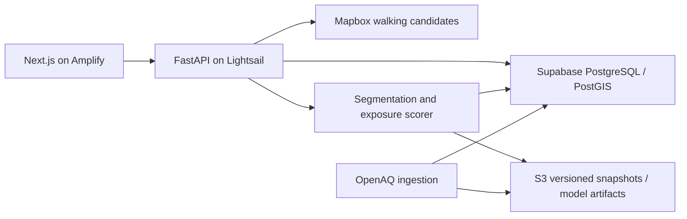

# AeroRoute implementation plan: 8–11 October 2026

**Build window:** Thursday, 8 October through Sunday, 11 October 2026. All times are IST (Asia/Kolkata).

**Source:** [AeroRoute revised proposal](AeroRoute_Revised_Proposal%20%281%29.pdf), pages 1–2.

**Current status:** The initial frontend, FastAPI service, request/data contracts, OpenAQ audit command, environment templates, container definition and CI foundation are implemented. See [SETUP_STATUS.md](SETUP_STATUS.md). Mapbox and Supabase access are verified; PostGIS application migrations are applied. OpenAQ coverage, pilot selection, actual observations, route scoring and AWS access/deployment remain pending. Unchecked tasks below are remaining work.

## 1. Sunday delivery target

Ship one browser-based flow for a verified Delhi pilot area:

1. Select an origin and destination and enter the maximum extra walking time in minutes.
2. Retrieve available walking-route candidates and display their geometry.
3. Estimate cumulative ambient PM2.5 exposure using segment concentrations and travel times.
4. Compare the fastest evaluated candidate with the lowest estimated exposure candidate within the time budget.
5. Show duration, exposure units, observation timestamps, coverage and uncertainty.
6. Demonstrate the deployed AWS backend and record a three-minute demo, including a case where a longer route has no estimated exposure benefit.

Deliver a working baseline before adding model complexity. Actual exposure reduction and street-level accuracy remain unvalidated; no health guarantee is part of this prototype.

## 2. Scope and responsibilities

The three-person team works concurrently across the responsibilities below; assign tasks within the team as needed. Assume roughly three focused hours tonight, six to eight hours per person on Friday and Saturday, and Sunday reserved for stabilization and recording. Reduce optional work first if availability is lower.

| Role | Primary responsibility | Handoff |
| --- | --- | --- |
| Frontend | Frontend and responsive map experience | Working interface against the agreed API contract |
| Data/model | Monitoring-data audit, interpolation, exposure estimates and validation | Versioned data snapshot, scorer and validation report |
| Backend/AWS | FastAPI, routing, database, AWS, workflows and integration | Comparison API and deployed backend |
| All three | End-to-end checks, claims review and demo | Reproducible Sunday demonstration |

| Priority | Work |
| --- | --- |
| Required by Sunday | Walking + PM2.5; one pilot area; origin/destination input; detour control; evaluated-route comparison; interpolation; data quality states; Supabase spatial lookup/cache; Amplify frontend; Lightsail backend; S3 snapshots; CI; validation report; recorded demo |
| Conditional experiment | Gradient-boosted regressor using station-hour labels, road context and weather; only after the required flow works and held-out evaluation is possible |
| After Sunday | CNN; Sentinel-5P regional features; broader geography; field validation; additional travel modes |

Open-Meteo weather and OSM/OSMnx feature extraction belong to the conditional model experiment. They must not block baseline exposure scoring or the demo. Satellite NO2 and aerosol index must not be substituted for measured PM2.5.

## 3. Repository layout

Maintain one frontend, one backend, one workflows directory and one documentation directory. Model/data work lives inside `backend/`.

Original scaffold (the initial setup adds application and configuration files beneath these directories):

```text
AWS-DTU/
├── README.md
├── .gitignore
├── frontend/
│   └── README.md
├── backend/
│   └── README.md
├── .github/
│   └── workflows/
│       └── ci.yml
└── documentations/
    ├── AeroRoute_Revised_Proposal (1).pdf
    └── IMPLEMENTATION_PLAN.md
```

Full build target layout; the setup implements a subset, with deployment and validation work still pending:

```text
frontend/
├── src/app/             # Page and layout
├── src/components/      # Journey form, map, route cards, data-quality notice
├── src/lib/             # API client and map helpers
├── src/types/           # Shared response types
├── tests/               # Critical browser flow
├── package.json
└── .env.example

backend/
├── app/api/             # Health, pilot metadata and comparison endpoints
├── app/core/            # Configuration and database connection
├── app/schemas/         # Request/response models
├── app/services/        # Provider clients, segmentation, scoring and cache
├── app/model/           # Interpolation and conditional regressor
├── migrations/          # PostGIS, stations, observations and cache tables
├── scripts/             # Data audit, ingestion, evaluation and deployment helpers
├── tests/fixtures/      # Small, labelled recorded/synthetic test cases
├── Dockerfile
├── pyproject.toml
└── .env.example

.github/workflows/
├── ci.yml
└── deploy-backend.yml

documentations/
├── API_CONTRACT.md
├── DATA_AUDIT.md
├── VALIDATION_REPORT.md
├── DEPLOYMENT.md
└── DEMO_SCRIPT.md
```

Amplify build settings can be configured in its console; add a root build-spec file only if the team chooses to version that configuration.

## 4. Daily schedule and completion gates

| Day | Focus | Must be working before stopping |
| --- | --- | --- |
| Thursday, 8 Oct | Access checks, pilot decision, contract and app skeletons | Verified provider access or an explicit blocker; agreed contract; local frontend and backend start |
| Friday, 9 Oct | Real routes, data ingestion, baseline scoring and early AWS deployment | One journey returns scored candidates; frontend consumes the API; deployed health endpoint |
| Saturday, 10 Oct | Integration, quality states, validation and full deployment | Required flow works on AWS; edge cases pass; baseline validation recorded; feature freeze at 18:00 |
| Sunday, 11 Oct | Regression checks, documentation and recorded demo | Demo rehearsed and recorded; repository and deployment handoff complete by 18:00 |

### Thursday, 8 October — tonight, approximately 3 focused hours

**First hour: remove access and data uncertainty.**

- [ ] **Backend/AWS:** Verify Mapbox routing access, AWS access in the chosen region, Supabase connectivity and the repository's GitHub Actions settings. Record dependencies and account limits.
- [ ] **Data/model:** Audit Delhi PM2.5 stations, units, provider metadata, recent observation times and historical availability. Save findings in `DATA_AUDIT.md`; do not select the pilot just from the project name or a convenient map location.
- [x] **Frontend:** Implement the initial journey form, optional map selection, comparison placeholders and data-quality notice. Searchable addresses remain optional polish.

**Second hour: agree the contract and initialize applications.**

- [x] **All:** Define the initial coordinate/time-budget contract and explicit pending API states in `API_CONTRACT.md`.
- [ ] **All:** Choose a pilot boundary after the audit and finalize data-quality rules using real monitoring evidence.
- [x] **Backend/AWS:** Initialize FastAPI, configuration, `/health`, request validation and local CORS. Add the backend environment template and container skeleton.
- [x] **Frontend:** Initialize Next.js, TypeScript and Tailwind inside `frontend/`; add the page shell, map component and form with clearly pending results.

**Final hour: prepare Friday's real data path.**

- [ ] **Data/model:** Save a small genuine monitoring snapshot with observation and fetch times; specify the interpolation interface and draft freshness/coverage parameters.
- [ ] **Backend/AWS:** Run one walking-directions request for a pilot journey; inspect candidate count, geometry and step timings. Prepare database migrations and CI commands once the dependency manifests exist.
- [ ] **All:** Check that both apps start locally, choose demo journey candidates and assign Friday's remaining blockers.

**Gate:** Access and pilot evidence are recorded; applications start; the contract is fixed. If fresh Delhi data is unavailable, explicitly plan a recorded-data replay with original timestamps and a visible limited-data live state. The live-data target remains unmet until access/coverage is resolved.

### Friday, 9 October — routing, baseline and deployment skeleton

**09:30–12:30: implement independently against the contract.**

- [ ] **Backend/AWS:** Implement the walking-route provider client, normalize route IDs/geometry/durations, validate inputs and handle provider errors/timeouts. Enable PostGIS and apply stations/observations/cache migrations.
- [ ] **Data/model:** Implement ingestion with deduplication, unit checks, timestamps and distance-weighted station interpolation. Fetch historical station-hour labels in the background for validation; historical downloads must not block current scoring.
- [ ] **Frontend:** Implement origin/destination selection, the detour slider/numeric input, map overlays, route cards and loading/error/single-route states.

**13:30–16:30: make one real comparison work.**

- [ ] **Backend/AWS + Data/model:** Segment routes, preserve travel time, compute cumulative exposure, enforce the exact detour limit and implement comparison responses and cache versioning.
- [ ] **Frontend:** Replace development fixtures with the comparison API; show units, source timestamps, data mode and coverage limitations.
- [ ] **Backend/AWS:** Configure Amplify for the frontend subdirectory and deploy the minimal FastAPI container to Lightsail. Verify the public health endpoint early so hosting problems surface before Saturday.

**16:30–18:30: integration checkpoint.**

- [ ] **Backend/AWS:** Add CI for frontend checks/build, backend lint/tests and container build. Configure S3 timestamped snapshots and document the basic deployment procedure.
- [ ] **All:** Run one pilot journey end to end locally, adjust its detour allowance and verify any selected alternative stays within the limit.
- [ ] **Data/model:** Record baseline spot checks and confirm whether there are enough independent stations/time periods for Saturday's validation and optional model experiment.

**Gate:** Real route geometry and a real-data baseline score reach the browser; the AWS backend health check works. If this gate slips, cancel optional model/weather/road-feature work and finish the core flow first.

### Saturday, 10 October — reliability, validation and full AWS flow

**09:30–12:30: finish required behavior.**

- [ ] **Backend/AWS + Data/model:** Add missing/stale/limited-coverage behavior, uncertain-ranking behavior, exact-budget boundaries and safe handling when the fastest route is also the lowest-exposure candidate.
- [ ] **Frontend:** Finish all data-quality states and mobile layout; keep replay labels and observation times visible. Prevent an older API response from replacing a newer journey/detour request.
- [ ] **Backend/AWS:** Complete the full Amplify-to-Lightsail flow, production CORS, Supabase queries/cache and S3 snapshot loading; verify the deployed container reports its app/data/model versions.

**13:30–16:30: validate and make the model decision.**

- [ ] **Data/model:** Evaluate interpolation with held-out stations and later time periods; record MAE/RMSE, sample counts, split rules, missingness and spatial limitations in `VALIDATION_REPORT.md`.
- [ ] **Data/model, only if the required flow already passes:** Assemble road, weather and time features and evaluate one gradient-boosted regressor with the same leakage-safe splits. Adopt it only if a documented improvement and acceptable serving cost are demonstrated; otherwise keep interpolation and record the outcome.
- [ ] **Backend/AWS + Frontend:** Run the acceptance matrix below against the integrated app and measure response latency with cache hits and misses separated.
- [ ] **All:** Select a reproducible case where a longer route fails to lower estimated cumulative exposure. Use genuine observations when possible; label any recorded replay or synthetic illustration explicitly.

**16:30–18:00: freeze the build.**

- [ ] **Backend/AWS:** Redeploy the validated build, finish the backend deployment workflow and smoke-check the public URLs.
- [ ] **All:** Close material integration failures, record known limitations and freeze new features at **18:00**. Begin the demo script and deployment handoff.

**Gate:** The required AWS flow and edge states pass. Validation is reported honestly; unavailable validation is marked unavailable with its cause, never replaced by invented error figures.

### Sunday, 11 October — stabilization and demonstration

- [ ] **09:30–11:00, all:** Recheck the deployment, provider access, current data age, detour enforcement, narrow/mobile layout and the core regression cases. Fix demo-blocking failures only.
- [ ] **11:00–13:00, Backend/AWS:** Finish setup/run instructions, environment-variable inventory, public endpoints, deployed versions and rollback instructions in `DEPLOYMENT.md` and the README.
- [ ] **11:00–13:00, Data/model:** Finalize data sources, pilot rationale, evaluation results and model limitations. Store the demonstration snapshot in S3 with a manifest identifying its sources and original observation times.
- [ ] **11:00–13:00, Frontend:** Finalize the three-minute script, screenshot/recording layout and readable freshness/uncertainty copy.
- [ ] **14:00–16:00, all:** Rehearse twice and record the full demonstration. Clearly identify whether each case uses live observations, recorded observations or synthetic test data.
- [ ] **16:00–18:00, all:** Verify the recording plays, links work, CI passes and handoff documentation matches the shipped behavior. Record deferred work and mark completed tasks.

**Gate:** Demo video, running URLs, reproducible setup and validation/limitations documentation are ready by **18:00 IST**. This is an internal target; no external submission deadline was provided.

## 5. Architecture and API handoff



| Endpoint to implement | Contract |
| --- | --- |
| `GET /health` | Process health and application version; keep provider availability separately observable |
| `GET /api/pilot` | Pilot boundary, supported mode, data mode, observation-time range and coverage notice |
| `POST /api/routes/compare` | Origin/destination as `{lat, lng}`, `max_detour_minutes >= 0`, walking mode; returns evaluated candidates and comparison metadata |

The comparison response must include route IDs, GeoJSON geometry, distance in metres, duration in seconds, exposure in `µg·min/m³` or `null`, within-budget flags, fastest ID, lowest-exposure eligible ID or `null`, recommendation status, warnings and model-estimated reduction or `null`. Include source/provider IDs, observation-time range, fetch time, coverage, live/replay mode and data/model version. Keep timestamps in UTC internally and display them clearly in the interface.

Suggested result states: `comparison_available`, `uncertain_difference`, `no_lower_exposure_candidate`, `single_candidate`, `limited_data` and `no_route`. A provider failure must not silently become a successful fixture response. Recorded replay is a visible, explicit mode.

Database minimum: stations with spatial coordinates; observations with sensor/time/unit/value metadata; snapshot manifests; and route comparison cache entries with expiry and data/model version. Include origin, destination, travel mode, time bucket, data/model version and detour allowance in the comparison cache key. A cached response must be reassessed for freshness when served.

## 6. Scoring and data-quality rules

1. Compute the fastest evaluated candidate using minimum **duration**, rather than assuming provider response order means fastest. Recommendations cover evaluated candidates only.
2. Use route step geometry/timing to subdivide the route at a documented sampling interval. Allocate each step's time across subsegments in proportion to length; preserve total route time within a tested numerical tolerance. Handle zero-length/zero-duration steps explicitly. Sampling creates calculation points, not measured street-level resolution.
3. Estimate each segment's PM2.5 from usable nearby stations in the same versioned snapshot. Start with inverse-distance weighting, e.g. `weight = 1 / max(distance, epsilon)^2`; define the station radius, nearest-station count, freshness threshold and colocated-station behavior after the data audit. These are prototype parameters, not validated standards.
4. Normalize concentrations to `µg/m³` and convert seconds to minutes exactly once: `exposure = sum(segment_pm25 * segment_duration_seconds / 60)`.
5. Enforce `candidate_duration_seconds <= fastest_duration_seconds + 60 * max_detour_minutes` before display rounding. Rank eligible, comparably supported candidates by exposure, then duration for ties.
6. Never replace missing PM2.5 with zero. Incomplete coverage must not make a route appear artificially cleaner; expose coverage and withhold a comparable full-route score/recommendation when evidence is insufficient.
7. Test ranking sensitivity using plausible, spatially varying concentration errors. Derive perturbations from validation residuals where possible; document assumptions otherwise. A uniform multiplier alone cannot reveal route-ranking instability. Mark differences uncertain when rankings are unstable or coverage is inadequate; sensitivity ranges are not calibrated confidence intervals.
8. Calculate percentage reduction only with comparable valid scores and a positive fastest-route exposure: `100 * (E_fastest - E_selected) / E_fastest`. Suppress it for inadequate/uncertain evidence and label any displayed value **model estimate**.

**Illustrative test, not Delhi observations:** A 20-minute route at 80 µg/m³ has exposure 1,600 µg·min/m³. A 25-minute route at 70 µg/m³ has exposure 1,750 µg·min/m³: lower concentration still produces greater cumulative exposure. At 50 µg/m³, the 25-minute route instead scores 1,250 µg·min/m³, a model-estimated reduction of 21.875%, and is eligible only if at least five extra minutes are allowed.

## 7. Provider and deployment checks

- Use OpenAQ v3 with server-side `X-API-Key` authentication. [OpenAQ API key documentation](https://docs.openaq.org/using-the-api/api-key).
- Fetch historical labels from sensor measurement/hour resources in bounded periods; preserve unit and period metadata. [OpenAQ measurements documentation](https://docs.openaq.org/resources/measurements).
- Determine freshness from observation time, not fetch time; latest readings alone do not establish complete historical coverage. [OpenAQ latest documentation](https://docs.openaq.org/resources/latest).
- Request Mapbox walking candidates with `alternatives=true`, `steps=true`, `geometries=geojson` and `overview=full`. Up to two alternatives can be returned, but fewer are possible. Step durations are in seconds. Walking comparisons must not depend on driving-traffic congestion annotations. [Mapbox Directions documentation](https://docs.mapbox.com/api/navigation/directions/).
- Enable PostGIS in a dedicated schema and add spatial lookup for station locations. [Supabase PostGIS documentation](https://supabase.com/docs/guides/database/extensions/postgis).
- Configure Amplify's app root as `frontend`; match any build-spec `appRoot` to `AMPLIFY_MONOREPO_APP_ROOT`. Verify the selected Next.js/runtime version with a real build on Friday. [Amplify monorepo documentation](https://docs.aws.amazon.com/amplify/latest/userguide/monorepo-configuration.html), [Next.js deployment documentation](https://docs.aws.amazon.com/amplify/latest/userguide/getting-started-next.html).
- Bind FastAPI to the container's public port and configure Lightsail's health-check path as `/health`. Verify the public HTTPS URL. [Lightsail container deployment documentation](https://docs.aws.amazon.com/lightsail/latest/userguide/amazon-lightsail-container-services-deployments.html).
- Keep provider/database credentials on the backend; expose only the intended browser map token and API URL to the frontend. Add placeholders in `.env.example`, and document settings for pilot bounds, freshness, station radius and data mode.
- Store timestamped data snapshots and any evaluated model artifacts in S3 with source/version manifests. Use GitHub Actions for CI and backend deployment; let Amplify handle frontend deployment from its configured branch. Document the known-good backend image so it can be redeployed.

The documentation checks above were made on 8 October 2026. Credentials, Delhi coverage, service limits and actual deployment behavior still require the team's access checks.

## 8. Acceptance and validation matrix

| Check | Expected evidence |
| --- | --- |
| Exposure arithmetic | Constant-concentration and mixed-segment fixtures match hand calculations; seconds/minutes conversion is correct |
| Segmentation | Subsegment durations preserve route duration; repeated coordinates and zero-length steps do not corrupt scores |
| Detour boundary | Exact limit passes; just over the limit fails; rounded displayed minutes never control eligibility |
| Ranking | Fastest is determined by duration; lowest exposure is selected only within the allowance; ties favor shorter time |
| Longer route counterexample | Lower concentration but higher cumulative exposure yields no improvement recommendation |
| Fewer alternatives | One candidate renders without a fabricated comparison; no-route response has a usable error state |
| Missing/stale data | Visible limited-data state; missing values do not become zeros; unsupported reduction is suppressed |
| Uncertain difference | Ranking instability is disclosed; app avoids a firm improvement claim |
| Bad inputs/provider failure | Invalid coordinates/negative detour are rejected; timeout/rate-limit states are recoverable |
| Cache behavior | Changed allowance or data/model version cannot reuse an incompatible comparison; freshness survives cache hits |
| Model validation | Station and temporal holdouts avoid target leakage; baseline and optional regressor use identical evaluation splits |
| Responsiveness/integration | Journey form, overlays and cards work at desktop and ~390 px mobile width; newest request controls the screen |
| Deployment | Public frontend calls the AWS backend; container health check, database and snapshot read work |
| Performance | At least ten repeated pilot comparisons logged with hit/miss and observed latency; report median and tail latency, not a promised speed |
| Replay transparency | Recorded observations retain original timestamps; replay and synthetic examples cannot be mistaken for live evidence |

Station-level MAE/RMSE do not validate street-level accuracy. If independent stations or later periods are unavailable, record that limitation and withhold unsupported validation claims. A prototype performance target of under five seconds for cached comparisons is a goal to measure, not a proposal result.

## 9. Risks, cutoffs and fallback decisions

| Trigger | Decision |
| --- | --- |
| No reliable fresh pilot data on Thursday | Show limited-data live behavior; prepare a visibly labelled genuine recorded snapshot replay; keep live coverage as an open blocker |
| Route provider offers no alternatives | Display the available route honestly; test multiple pilot journeys without promising alternatives everywhere |
| Historical labels/splits are insufficient | Keep interpolation; document why regressor evaluation could not be completed |
| Core flow is incomplete Friday evening | Drop address search, weather/road features and regressor work; preserve required reliability states |
| AWS skeleton is not healthy Friday | Treat deployment as the next priority; stop optional model work until the hosting path is proven |
| AWS is still blocked Sunday | Record the runnable local flow and the blocker explicitly; do not mark the AWS deliverable complete |
| Baseline cannot reliably distinguish routes | Show uncertain/no-lower-exposure result; do not force a positive demo outcome |
| Work remains after Saturday 18:00 | Fix core failures; defer new features to the post-Sunday backlog |

## 10. Three-minute demo outline

| Time | Demonstration |
| --- | --- |
| 0:00–0:25 | Explain cumulative exposure, the walking pilot and the time budget |
| 0:25–1:20 | Enter/select a journey, compare evaluated routes and adjust the detour allowance |
| 1:20–1:55 | Show observation times, coverage and any uncertain/limited-data behavior |
| 1:55–2:25 | Show the longer-route counterexample; identify any replay or synthetic illustration |
| 2:25–2:45 | Show the AWS backend endpoint and the deployed app connection |
| 2:45–3:00 | State validation findings, limits and what needs field validation |

**Sunday handoff:** public app/backend URLs, passing checks, environment/setup instructions, pilot data audit, validation report, deployed version and snapshot identifiers, limitations/deferred work, demo script and playable recording. Update the root README to match the actual shipped state.
